# LaLiga Quiniela

<p align="center">
  
  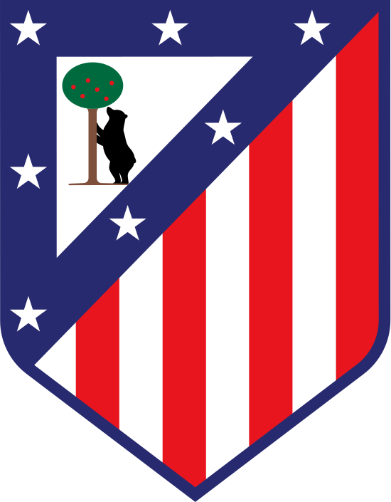
  
  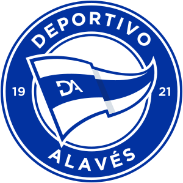
  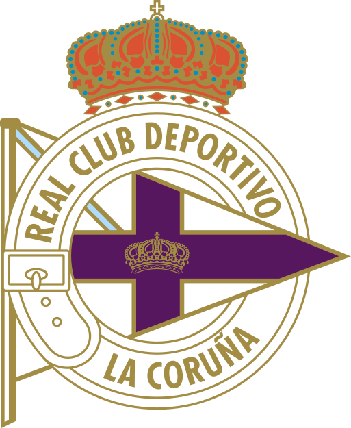
  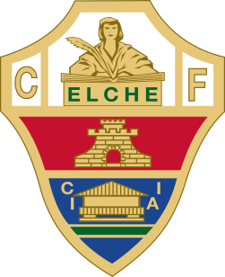
  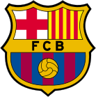
  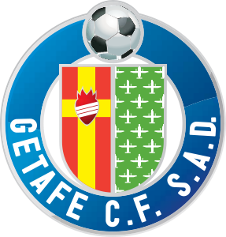
  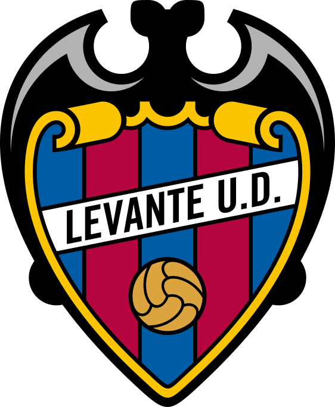
  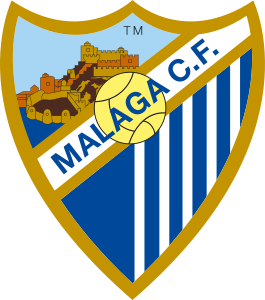
  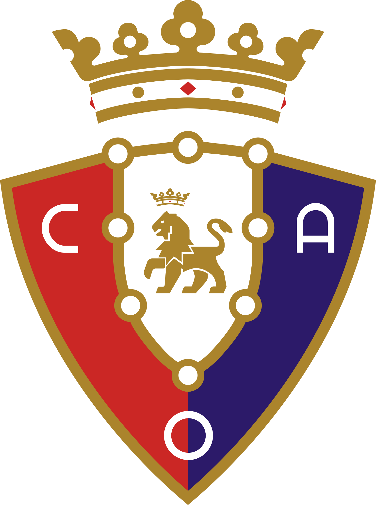
  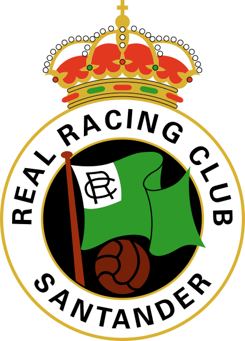
  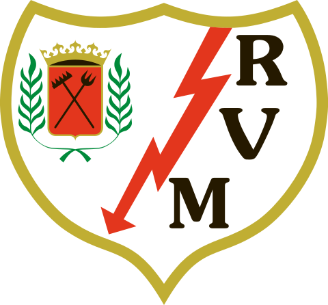
  
  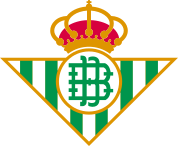
  
  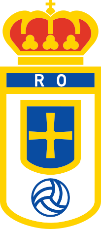
  
  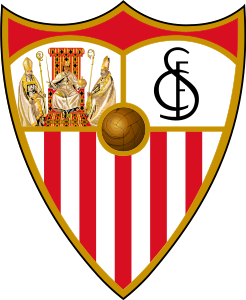
  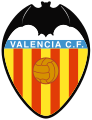
</p>

A soccer prediction platform ("Quiniela") for the Spanish Football League (LaLiga). Users submit 1/X/2 predictions for each matchday's fixtures before kickoff, and scores are calculated automatically once official results are entered.

## Tech Stack

- **Backend:** PHP 8.4+, Laravel
- **Frontend:** Vue 3 (Composition API, `<script setup>`) + TypeScript
- **SPA Connector:** Inertia.js
- **Styling:** Tailwind CSS
- **Database:** SQLite (development)

## Getting Started

This project runs fully inside Docker — no need to install PHP, Composer, Node or a database on the host.

```bash
npm run docker:up      # builds (if needed) and starts the app, queue and vite containers
```

The first boot installs Composer/npm dependencies, generates `.env`/`APP_KEY`, creates the SQLite database and runs migrations automatically.

- App: http://localhost:8000
- Vite dev server (HMR): http://localhost:5173

```bash
npm run docker:logs                              # follow logs from all services
npm run docker:artisan -- migrate:fresh --seed   # run artisan commands
npm run docker:sh                                # open a shell inside the app container
npm run docker:down                              # stop and remove the containers
```

See [`.devcontainer/README.md`](.devcontainer/README.md) for more details on the stack.

## Development

```bash
npm run docker:artisan -- test   # run the test suite inside the container
```

## Data

The LaLiga 2026/2027 match calendar (matchdays and fixtures) lives in [`resources/json/schedule-laliga-2026-2027.json`](resources/json/schedule-laliga-2026-2027.json), used to seed the quiniela's rounds and fixtures.

Team logos live in [`public/assets/images/team-logos`](public/assets/images/team-logos), one SVG per team, served directly at `/assets/images/team-logos/{slug}.svg`. Each file is named after the team's normalized slug, matching the `home_team_normalized` / `away_team_normalized` fields in the schedule JSON (e.g. `Deportivo Alavés` → `deportivo-alaves.svg`).
